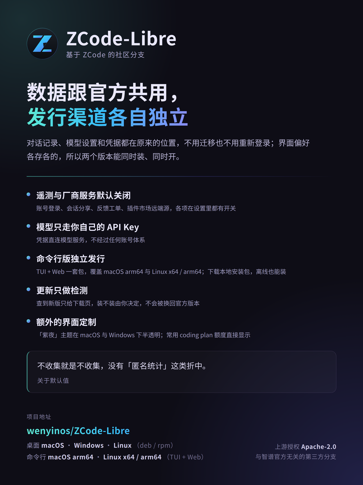

# ZCode-Libre

<div align="center">
  
</div>
<p align="center">
  简体中文 | <a href="README.en.md">English</a>
</p>
<p align="center">
  <a href="https://wenyinos.github.io/ZCode-Libre/">项目站点</a> ·
  <a href="https://github.com/wenyinos/ZCode-Libre/releases">下载</a> ·
  <a href="https://github.com/wenyinos/ZCode-Libre/discussions">讨论</a>
</p>

ZCode-Libre 是 AI 编程工作台，提供桌面应用、浏览器界面和终端 Agent。本仓库包含客户端、后端服务、共享 UI，以及 Agent CLI 与运行时源码。

ZCode-Libre 是 [ZCode](https://github.com/zai-org/ZCode) 的社区分支，遵循 Chrome → Chromium、VS Code → VSCodium 的分支模式：保留上游的完整功能与代码历史，另行使用独立的品牌身份与发行渠道，便于独立审计、独立分发和本地化定制。

<div align="center">
  <a href="docs/promo/intro-poster.png">
    
  </a>
  <br />
  <a href="https://wenyinos.github.io/ZCode-Libre/">wenyinos.github.io/ZCode-Libre</a>
</div>

## 与上游的区别

| 维度       | 上游 ZCode           | ZCode-Libre                            |
| ---------- | -------------------- | -------------------------------------- |
| 产品名称   | ZCode                | ZCode-Libre                            |
| 应用标识   | `dev.zcode.app`      | `dev.zcode-libre.app`                  |
| 应用图标   | 圆角方形 + 白色 Z    | 圆形 + 青蓝渐变 Z                      |
| 发行渠道   | 上游官方 Releases    | 本仓库自行构建与分发                   |
| 会话与设置 | ——                   | 与上游共用                             |
| 界面偏好   | `ZCode` 数据目录     | `ZCode-Libre` 数据目录（互相独立）     |

**会话与设置和上游共用**。对话记录、模型设置与模型服务商凭据存放在 `.zcode` 数据根（如 `~/.zcode/cli/db/db.sqlite`、`~/.zcode/v2/setting.json`），两边完全互通：装上本分支就能直接读到官方客户端的对话与配置，无需迁移数据或重新登录。（唯一的例外是官方账号相关凭据，见下一条。）

**界面偏好各自独立**。Electron 用户数据目录使用 `ZCode-Libre`，主题、语言、面板布局等界面偏好以及内置浏览器/Coding Plan 内嵌页的登录态互不影响。因此两个客户端**可以同时运行**，也不会因两边版本分叉而共用 Electron 缓存。

**官方账号与官方订阅不参与**。本分支不提供官方账号登录，也不读取官方客户端登录后留在共享数据里的凭据（登录票据、账号级密钥一律视为不存在）——所以即便你在官方客户端登录过，本分支也仍然显示未登录。

这不是"少给功能"，而是这些凭据在本分支里注定半途而废：上游开源版本身就声明「**不承诺提供官方产品的全部功能及活动政策**」（见 [NOTICE.md](NOTICE.md)），用户借官方登录态进来，拿不到自己在官方客户端里预期的那套套餐与活动；而且登录票据会过期，刷新要靠重新登录，本分支的登录入口是关的，最终只会落到"能用一阵子、然后突然失效且无法自助恢复"。模型请在「模型服务商」里填**自己的 API Key** 接入。

从上游同步更新的流程与全部偏离点见 [UPSTREAM.md](UPSTREAM.md)。

以下标识**有意保持与上游一致**，因为它们是跨端契约而非品牌展示位，改动会破坏与既有服务端、协议和用户项目的兼容性：`zcode://` 协议 scheme、`@zcode/*` 包 scope、`ZCODE_*` 环境变量前缀、`.zcode` 数据根目录（含用户项目里的 `.zcode/config.json`、`.zcode/agents`）、`zcode` CLI 命令名。

## 和官方客户端同时运行时

两边共用 `.zcode` 数据根，应用本身可以同时开着。共享数据的并发语义分几种情况，值得先知道：

**不同会话并行 —— 受支持。** 数据库跑在 WAL 模式，写入事务有等锁重试（最长 1 小时，等待期间界面会显示状态），自动化/定时任务用的是原子 single-flight 认领，不会重复执行。**两个客户端同时跑不同的会话是正常用法，不会损坏数据库。**

**同一个会话 —— 只在一端操作。** 代码里没有跨客户端的会话互斥，而且有一处会把对方的运行误判成崩溃残留：当某个客户端读到"会话上有活跃运行、但本进程没在跑"时，会按「上次异常退出留下的标记」处理，把运行计时结算掉、目标状态从进行中改为暂停。结果是另一端的运行计时被提前截断，而它自己不会收到任何提示。所以同一个会话请只在一端操作；要并行就开不同会话。

**设置不要两边同时改。** `setting.json` 与 `provider_config.json` 的写入是原子替换（不会写坏文件），但没有跨进程文件锁，两边同时改会丢更新（后写的赢）。改完一边、等它落盘，再动另一边。

**升级尽量两边一起。** 先升级的那个会把共享库迁移到新结构，另一个还停在旧版本时，通常仍能跑，但遇到结构性迁移可能报错。本分支没有改动存储层，所以只要两边版本线一致就没有这个问题。

## 遥测与厂商服务

本分支默认关闭遥测与依赖厂商后端的服务。改动走**默认关闭、不删代码**的路线，以便跟随上游同步；开关集中登记在 [UPSTREAM.md](UPSTREAM.md)。

| 项目 | 默认 | 开启方式 |
| --- | --- | --- |
| 遥测上报（数仓 / ARMS / OTLP） | 关闭 | 设 `ZCODE_TELEMETRY_ENABLED=1` |
| 官方账号登录（z.ai / BigModel OAuth） | 关闭 | 设 `ZAI_OAUTH_ENABLED=1` / `BIGMODEL_OAUTH_ENABLED=1` |
| 会话分享（上传对话到远端） | 关闭 | `packages/shared/src/libre-features.ts` |
| 用户反馈 | 关闭 | 同上 |
| Coding Plan 套餐购买入口 | 关闭 | 同上 |
| 插件市场远端源（CDN 清单） | 关闭 | 同上；内置插件不受影响 |
| 应用内更新 | 仅检测自有 Release | 检测到新版本后引导前往本仓库 Releases 下载，不在应用内下载或安装 |

内置能力插件（浏览器控制、文档、PDF、表格、演示文稿等）默认保持启用，它们不依赖厂商服务。

### 更新

「帮助 → 检查更新」只查询本仓库的 GitHub Release 并比较版本，不会像上游那样从厂商服务器取更新清单——那会把官方 ZCode 装回来覆盖本分支。检测到新版本时，界面给出「前往下载」按钮，在浏览器中打开 Release 页面，由你选择对应平台的安装包自行下载安装。

### 用 API Key 接入模型

官方账号登录默认关闭，模型通过 API Key 接入，**无需任何账号**：

1. 首次启动显示配置页，默认就是 API Key 表单；也可随时从「设置 → 模型服务商」添加。
2. 选择渠道、填入 API Key、保存即可，重启后不会再被登录页拦截。

两种 Key 的请求路径不同，按需选择：

| 模板 | 端点 | 请求路径 |
| --- | --- | --- |
| Z.ai / BigModel **标准 API** | `https://api.z.ai/api/paas/v4`、`https://open.bigmodel.cn/api/paas/v4` | **直连**厂商 API，不经过任何中间网关 |
| Z.ai / BigModel（登录页默认） | `https://api.z.ai/api/anthropic`、`https://open.bigmodel.cn/api/anthropic` | 经 ZCode 平台网关做套餐权益校验后转发（鉴权头原样透传，不依赖账号登录态） |

需要完全绕开厂商网关时，在「设置 → 模型服务商」选择**标准 API** 模板；使用 Coding Plan 的 Key 则需走网关，因为套餐权益校验在网关侧完成。

## 更新

- 2026-09-24：建立 ZCode-Libre 品牌分支。独立应用标识、独立数据目录、全新圆形标志，并同步上游 v3.14.3 源码。

## 初始化

准备 Git、Node.js **24.14.0** 和 pnpm **10.33.2**，版本以 [mise.toml](mise.toml) 为准。以下开发和打包命令均在仓库根目录执行。

```bash
pnpm bootstrap
```

`pnpm bootstrap` 安装 workspace 依赖、准备桌面本地运行资源，再执行 `build:bootstrap`。

Agent CLI 与运行时源码位于 [apps/zcode-cli/](apps/zcode-cli/)，作为普通目录随本仓库一起克隆，无需单独拉取或初始化 Git submodule。

根据需要选择其他初始化或构建入口：

| 命令                           | 用途                                                              |
| ------------------------------ | ----------------------------------------------------------------- |
| `pnpm install`                 | 安装依赖                                                          |
| `pnpm prepare:desktop-runtime` | 准备桌面运行资源，默认包含远程资源准备                            |
| `pnpm prepare:remote-assets`   | 单独准备远程运行资源                                              |
| `pnpm bootstrap:with-remote`   | 初始化依赖、本地与远程资源，并串行构建相关包；跳过桌面应用 bundle |
| `pnpm build`                   | 递归执行各 workspace 包的构建脚本，包括包内的资源准备步骤         |

默认 `bootstrap` 跳过远程资源准备，适合本地桌面开发。使用远程工作区或验证远程发行资源时，再运行对应准备命令。

## 开发与运行

### 桌面版

```bash
pnpm dev:desktop

# 使用测试环境
pnpm dev:desktop:test
```

`pnpm dev:desktop` 默认等同于 `pnpm dev:desktop:prod`，使用生产服务配置。启动脚本会准备本地运行资源、构建桌面 Agent，再启动 Electron 和源码监听。

需要独立开发数据目录时，可设置 `ZCODE_DATA_BASE_DIR`。例如在 macOS / Linux 中：

```bash
ZCODE_DATA_BASE_DIR="$HOME/.zcode-dev-home" pnpm dev:desktop:test
```

### 远程功能（SSH/WSL）

先执行 `pnpm bootstrap:with-remote` 准备远程资源（mock-cdn），再 `pnpm dev:desktop`；连接远程项目时资源选择「本地下载后上传」。开发态资源取自本地 `packages/desktop/mock-cdn` 和本地构建产物，经 SFTP 上传到远程，不访问 CDN。

### Web 开发

修改 Web 或后端源码时，使用开发模式：

```bash
pnpm dev:web

# 指定后端工作区（macOS / Linux）
ZCODE_SERVER_WORKSPACE=/path/to/project pnpm dev:web
```

该命令同时启动 Web 开发服务器（默认 `http://localhost:5173`）和后端（默认 `http://localhost:3030`）；浏览器访问前者。`/ws` 和一般 `/api` 请求代理到本地后端，`/api/v1/oauth/token` 单独代理到当前配置的产品服务。

Agent 源码修改后，执行 `pnpm --filter @zcode/cli... build` 并重启服务。需要验证完整发行包时，按下方“命令行版”打包章节解压运行。

### ZCode-Libre 命令行版

命令行发行包包含 TUI、Web 和 Agent，统一使用 `zcode` 启动：无参数进入 TUI；第一个参数为 `--web` 时启动 Web；其他参数交给现有 Agent CLI 处理。两种模式都在本机运行，无需 Electron。

```bash
# 默认进入终端交互界面
zcode

# 启动 Web 界面
zcode --web

# 指定项目和端口，不自动打开浏览器
zcode --web --workspace /path/to/project --port 3030 --no-open

# 查看 CLI 或 Web 参数
zcode --help
zcode --web --help
```

Web 模式默认工作目录为当前目录，监听 `127.0.0.1`，默认不启用访问令牌，自动选择空闲端口并打开浏览器。访问终端输出的地址，按 `Ctrl+C` 停止服务。局域网访问可使用 `--host 0.0.0.0`；监听非本机地址时默认生成访问令牌，使用终端输出的带令牌链接。可通过 `--token` 指定令牌或 `--no-token` 关闭令牌认证。

直接启动通用 Web 服务的 HTTP 入口时，通过 `ZCODE_SERVER_AUTH_TOKEN` 配置 API／WebSocket 认证；通过程序接口创建服务时，使用 `authToken` 选项。

构建方式见下方打包章节。`pnpm build:zcode` 只生成发行包，不会替换 `PATH` 中已有的 `zcode`。如果命令仍指向旧安装或其他源码目录，macOS / Linux 可用 `command -v zcode` 检查，Windows 可用 `where.exe zcode` 检查。

### CLI 源码开发

直接开发 TUI 或 Agent 时，运行源码入口：

```bash
pnpm --filter @zcode/cli dev --help
pnpm --filter @zcode/cli dev

# 构建 CLI 及其 workspace 依赖
pnpm --filter @zcode/cli... build
node apps/zcode-cli/packages/cli/dist/zcode.cjs --help
```

这个入口直接运行 Agent CLI，不经过发行包的 `--web` 分流。开发 Web 用 `pnpm dev:web`；验证统一的 `zcode` 命令，用下方解压后的 `bin/zcode.mjs`。

## 配置

根目录 [.env.example](.env.example) 提供服务地址与构建配置示例，可按需复制到 `.env`，本地覆盖放入 `.env.local`。Desktop 的开发环境通过 `dev:desktop:test` / `dev:desktop:prod` 选择。

| 配置                                 | 用途                                             |
| ------------------------------------ | ------------------------------------------------ |
| `ZCODE_DATA_BASE_DIR`                | 应用数据基目录，数据写入其下的 `.zcode/`         |
| `ZCODE_SERVER_WORKSPACE`             | Web 后端的工作区路径                             |
| `ZCODE_BUILTIN_PROVIDER_CONFIG_FILE` | 本地 Provider 配置文件路径；未设置时使用内置配置 |
| `ZCODE_DIST_BASE_URL`                | 命令行安装脚本使用的下载根地址                   |

运行时变量可在启动命令的环境中显式设置。随客户端发布的默认配置见 [config/README.md](config/README.md)。

## 打包

第三方声明生成、发行校验流程及声明在发行物中的位置见 [third-party/README.md](third-party/README.md)。

### 桌面版

```bash
pnpm bundle:desktop

# 指定目标平台与 CPU 架构
pnpm bundle:desktop -- --os win --arch x64

pnpm bundle:desktop -- --help
```

默认目标为 macOS arm64，默认输出目录为 `packages/desktop/dist/`。`--os` 支持 `mac`、`win`、`linux`，`--arch` 支持 `x64`、`arm64`；实际打包与签名需要目标平台对应的工具和配置。

安装：双击打开产物 DMG，将 ZCode-Libre 拖入"应用程序"。本地构建未签名，首次打开若被 macOS 拦截，执行：

```bash
sudo xattr -rd com.apple.quarantine /Applications/ZCode-Libre.app
```

### 命令行版

构建入口为 `pnpm build:zcode`。脚本会依次构建 CLI/TUI、后端和 Web，收集 TUI 的原生库、worker 与运行时依赖，再组装发行包；运行发行包仍需要 Node.js，版本以 `mise.toml` 为准。

打包前必须设置下载根地址 `ZCODE_DIST_BASE_URL`（可放在 `.env`、`.env.local` 或环境变量中），也可以通过 `--base-url` 传入。以下地址是占位示例，发布时替换为实际托管地址：

```bash
pnpm build:zcode --base-url https://downloads.example.com/zcode/

# 已配置 ZCODE_DIST_BASE_URL 时
pnpm build:zcode

# 仅重新组包，复用已有的 Agent、后端和 Web 构建产物
pnpm build:zcode --skip-build

# 查看版本、输出目录等可选参数
pnpm build:zcode --help
```

默认版本取根目录 `package.json`，输出目录为 `dist/zcode/`：

- `releases/<version>/zcode-<version>.tar.gz`：运行包。
- `releases/<version>/sha256.txt`：校验摘要。
- `latest.json`、`install.sh`：版本索引和安装脚本。

完整目录可上传到配置的下载根地址。安装脚本从该地址下载运行包，默认安装到 `~/.zcode/runtime`，并在 `~/.local/bin` 创建 `zcode` 命令。安装目录可通过 `ZCODE_DIST_HOME` 修改，命令目录可通过 `ZCODE_DIST_BIN_DIR` 修改。

本地调试打包产物时，可直接解压运行，无需上传或安装：

```bash
zcode_version=$(node -p "require('./dist/zcode/latest.json').version")
mkdir -p dist/zcode/debug
tar -xzf "dist/zcode/releases/$zcode_version/zcode-$zcode_version.tar.gz" \
  -C dist/zcode/debug
# 默认启动 TUI
node dist/zcode/debug/zcode/bin/zcode.mjs

# 启动 Web
node dist/zcode/debug/zcode/bin/zcode.mjs --web \
  --workspace "$PWD" --port 3030 --no-open
```

浏览器打开 `http://127.0.0.1:3030`，即可验证同一后端服务托管 Web 页面和 Agent 的完整链路。该端口需要空闲；如正在运行 `pnpm dev:web`，可改用其他 `--port`。

## 品牌资源

应用图标以 [public/logo/zcode-libre.svg](public/logo/zcode-libre.svg) 为唯一源文件。修改标志后重新生成全量位图资源：

```bash
python3 scripts/generate-logo-assets.py
```

脚本需要 ImageMagick（`magick` 命令，需 librsvg 支持）与 Python 的 Pillow，会把 PNG/ICO/ICNS 分发到 `public/logo/icons/`、`public/icon_512@2x.png` 与 `packages/desktop/build/`。

## 仓库结构

| 目录                                                 | 职责                                       |
| ---------------------------------------------------- | ------------------------------------------ |
| `packages/desktop`                                   | Electron Main、Host、Renderer 与桌面打包   |
| `packages/web`                                       | Web 客户端                                 |
| `packages/server`                                    | HTTP / WebSocket 服务与远程连接            |
| `packages/zcode-server-cli`                          | 独立 Server 启动与进程管理                 |
| `packages/ui`                                        | 共享 React 组件、hooks 与 Zustand 状态     |
| `packages/services`                                  | 业务服务与持久化                           |
| `packages/shared`、`packages/rpc`、`packages/client` | 共享协议和类型、RPC 框架、Agent 客户端 SDK |
| `packages/provider`、`packages/provider-node`        | Provider 公共能力与 Node 实现              |
| `apps/zcode-cli`                                     | Agent CLI、TUI、运行时与工具               |
| `scripts`、`config`、`third-party`                   | 构建维护脚本、内置配置与第三方声明材料     |

## 许可与来源

本仓库源码来自 ZCode，第一方代码依照根 [LICENSE](LICENSE) 采用 Apache-2.0，原始版权归 Z.AI Co., Ltd 所有。ZCode-Libre 的修改、品牌资源与构建产物由本分支维护，同样以 Apache-2.0 提供；该许可不替其他权利人新增授权，也不覆盖第三方软件、复制代码、原生二进制、字体、图标与网页素材。

功能范围、维护规则、执行与数据风险，以及完整的第三方版权说明，详见 [NOTICE.md](NOTICE.md)。
